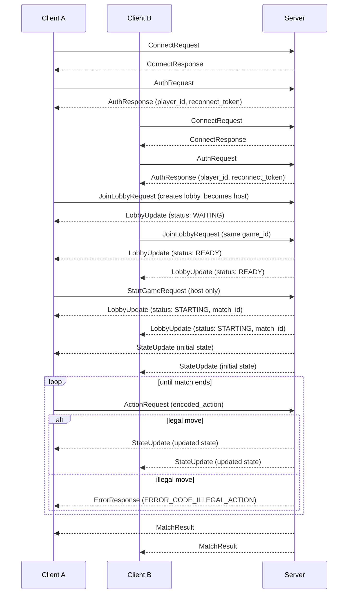

# RAMServer Wire Protocol — v1

Schema file: `ramserver.proto` (package `ramserver.v1`)

## Framing

Every message on the wire is a length-prefixed, serialized `ClientMessage` (client → server) or `ServerMessage` (server → client). Both are envelope messages—an actual message never appears on the wire on its own; it is always wrapped in one of these two `oneof` containers.

- `ClientMessage.sequence` — a client-assigned, monotonically increasing counter used to correlate a response to the request that caused it.
- `ServerMessage.in_reply_to` — echoes the `sequence` of the client message this is a direct response to. For unsolicited server pushes, such as broadcasts to everyone in a lobby or match, this is `0`.

## Message lifecycle

A client moves through four phases in order: **connect → authenticate → lobby → match**. Each phase's messages are valid only after the previous phase has completed.

### 1. Connect

| Message           | Direction       | Sent when                                                              |
| ----------------- | --------------- | ---------------------------------------------------------------------- |
| `ConnectRequest`  | client → server | Immediately after the TCP connection opens; must be the first message. |
| `ConnectResponse` | server → client | In reply to `ConnectRequest`.                                          |

**`ConnectRequest`**

- `protocol_version` — the schema version the client was built against. The server compares this against its own version and rejects a mismatch.
- `client_name` — free-text identifier for logging and debugging, such as `"ramserver-java-client"`.

**`ConnectResponse`** — sent only on success. On a protocol-version mismatch, the server sends `ErrorResponse` (`ERROR_CODE_INVALID_PROTOCOL_VERSION`) instead and closes the connection.

- `session_id` — server-assigned identifier for this TCP session.
- `server_protocol_version` — the server's schema version for client-side logging.

### 2. Authenticate

| Message        | Direction       | Sent when                             |
| -------------- | --------------- | ------------------------------------- |
| `AuthRequest`  | client → server | After a successful `ConnectResponse`. |
| `AuthResponse` | server → client | In reply to `AuthRequest`.            |

**Identity vs. display name — how impersonation is prevented**

`display_name` is cosmetic only: it is shown to other players, it may collide, and it is never used to establish who someone is. Identity is handled separately.

- **New player:** send `AuthRequest` with just `display_name` (leave `player_id` and `reconnect_token` empty). The server generates a new `player_id` and a secret `reconnect_token`, returned only to that client in `AuthResponse`.
- **Resuming player** (for example, after a dropped connection): send `AuthRequest` with the previously issued `player_id` **and** `reconnect_token`. The server only grants that identity back if the token matches what it issued. A client that only knows another player's `player_id` cannot assume that identity without also knowing the secret token, which is never broadcast to anyone.
- The token is never included in any broadcast message (`LobbyUpdate`, `StateUpdate`, `MatchResult`); it is only sent directly to its owner in `AuthResponse`.
- Once authenticated, every later message on that connection is attributed to that `player_id` by the server itself. No later message, including `ActionRequest`, carries a client-supplied player identity field, so a connection can never act as a different player mid-session.

**`AuthRequest`**

- `display_name` — cosmetic label shown to other players.
- `player_id` — identity to resume, if any; empty to register new.
- `reconnect_token` — secret proving ownership of `player_id`; empty to register new.

**`AuthResponse`** — sent only on success. On failure, the server sends `ErrorResponse` (`ERROR_CODE_AUTH_FAILED`) instead, indicating either an unknown `player_id` or a `reconnect_token` that does not match.

- `player_id` — the newly issued or resumed identity.
- `reconnect_token` — secret for this identity. Store it client-side only, such as in a local config file, if you want to support resuming later.

### 3. Lobby

A lobby holds players waiting for a specific game before a match starts. The server enforces each game's minimum and maximum player counts; the client never decides this and only reads the values the server reports. The first player to join a lobby becomes its **host**.

| Message             | Direction                                               | Sent when                                                                           |
| ------------------- | ------------------------------------------------------- | ----------------------------------------------------------------------------------- |
| `JoinLobbyRequest`  | client → server                                         | A player wants to join or create a lobby for a game.                                |
| `LeaveLobbyRequest` | client → server                                         | A player leaves a lobby before the match starts.                                    |
| `StartGameRequest`  | client → server                                         | The host manually starts the match once `min_players` is met.                       |
| `LobbyUpdate`       | server → client (broadcast to all players in the lobby) | Whenever lobby membership or status changes, including the transition into a match. |

**When a match actually starts** — two paths, both ending in `LOBBY_STATUS_STARTING`:

1. **Host-triggered:** once the lobby reaches `min_players` (status `READY`), the host sends `StartGameRequest`.
2. **Auto-start on full:** if the lobby reaches `max_players` at any point, it starts automatically and no `StartGameRequest` is needed.

**`JoinLobbyRequest`**

- `game_id` — `"tictactoe"`, `"chess"`, or `"gofish"`.
- `lobby_id` — leave empty to join any open lobby for `game_id`, or create a new one if none is open.
- Rejected with `ERROR_CODE_LOBBY_ALREADY_STARTED` if the target lobby's status is already `STARTING` or `CLOSED`; joining mid-match or post-match is never allowed.

**`StartGameRequest`**

- `lobby_id` — the lobby to start.
- Rejected with `ERROR_CODE_NOT_LOBBY_HOST` if the sender is not the host.
- Rejected with `ERROR_CODE_LOBBY_NOT_READY` if `min_players` has not been met yet.

**`LobbyUpdate`**

- `players` — the current lobby roster (`player_id`, `display_name` each).
- `host_player_id` — the one player allowed to send `StartGameRequest`; a client can use this to decide whether to show a "Start Game" button.
- `min_players` / `max_players` — the constraints for `game_id`, as declared by that game's registered ruleset on the server, such as chess (2/2) or Go Fish (2/4).
- `status` — see `LobbyStatus` below.
- `match_id` — populated once `status == LOBBY_STATUS_STARTING`; this is the id to use in all subsequent `ActionRequest` messages for the match.

**`LobbyStatus`**

- `LOBBY_STATUS_WAITING` — below `min_players`.
- `LOBBY_STATUS_READY` — `min_players` met, below `max_players`; the host may now send `StartGameRequest`.
- `LOBBY_STATUS_STARTING` — match initializing, triggered by the host or by reaching `max_players`. A `StateUpdate` with the initial game state follows shortly.
- `LOBBY_STATUS_CLOSED` — abandoned before starting, or superseded once the match begins.

### 4. Match

| Message         | Direction                                               | Sent when                                                        |
| --------------- | ------------------------------------------------------- | ---------------------------------------------------------------- |
| `ActionRequest` | client → server                                         | A player submits a move.                                         |
| `StateUpdate`   | server → client (broadcast to all players in the match) | After every validated action and once at match start.            |
| `ErrorResponse` | server → client                                         | An action is rejected, or any other protocol-level error occurs. |
| `MatchResult`   | server → client (broadcast to all players in the match) | The match reaches a win, loss, or draw condition.                |

**`ActionRequest`**

- `match_id` — from the `LobbyUpdate` that started this match.
- `encoded_action` — opaque bytes. The core does not interpret this; it hands the value directly to the match's registered `Ruleset` for validation.
- Carries no player identity field; see the impersonation note in Section 2. The acting player is always the identity attached to the sending connection and is resolved server-side.

**`StateUpdate`**

- `state_version` — increases with every applied action. A client can use this to detect and ignore a stale or duplicate broadcast.
- `encoded_view` — opaque bytes: a per-recipient view of state. This lets a game with hidden information, such as a Go Fish hand, send each player only what they are allowed to see instead of the full authoritative state.
- `active_player_id` — whose turn it is now.
- `player_order` — the full turn order for the match. Needed for games with more than two players, where "next turn" is not just "the other player."

**`ErrorResponse`**

- `code` — see `ErrorCode` below.
- `message` — human-readable detail for logging or display only; clients should branch on `code`, not on this string.
- `match_id` — set if the error is scoped to a specific match or action; empty for connection- or lobby-level errors.

**`ErrorCode`**
| Code | Meaning |
| --- | --- |
| `ERROR_CODE_INVALID_PROTOCOL_VERSION` | Client's `protocol_version` is incompatible with the server. |
| `ERROR_CODE_AUTH_FAILED` | Unknown `player_id`, or `reconnect_token` did not match. |
| `ERROR_CODE_UNKNOWN_GAME` | `game_id` has no registered ruleset. |
| `ERROR_CODE_LOBBY_FULL` | Join attempted on a lobby already at `max_players` (should be rare because full lobbies auto-start). |
| `ERROR_CODE_LOBBY_NOT_FOUND` | `lobby_id` does not exist. |
| `ERROR_CODE_LOBBY_ALREADY_STARTED` | Join attempted on a lobby whose status is already `STARTING` or `CLOSED`. |
| `ERROR_CODE_NOT_LOBBY_HOST` | `StartGameRequest` sent by someone other than the host. |
| `ERROR_CODE_LOBBY_NOT_READY` | `StartGameRequest` sent before `min_players` was met. |
| `ERROR_CODE_MATCH_NOT_FOUND` | `match_id` does not exist. |
| `ERROR_CODE_OUT_OF_TURN` | Action submitted by a player who is not `active_player_id`. |
| `ERROR_CODE_ILLEGAL_ACTION` | Action rejected by the ruleset's legality check. |
| `ERROR_CODE_MALFORMED_MESSAGE` | `encoded_action` could not be parsed by the active ruleset. |

**`MatchResult`**

- `winner_player_ids` — empty if `draw` is `true`; can hold more than one id if a game or ruleset supports tied or shared outcomes.
- `summaries` — per-player counts of accepted versus rejected actions during the match, pulled from the persisted action log. This is useful for the demo and testing requirement to show that illegal actions were rejected.

### Session flow diagram

The sequence below shows a full session for a 2-player match: connect,
authenticate, join a lobby, play until a match result. `Server` broadcasts
(`LobbyUpdate`, `StateUpdate`, `MatchResult`) to every player in the
lobby/match, not just the sender. Once a player authenticates, they request to join a lobby for a game.
Players cannot choose to join a specific lobby, the server automatically places them in an open lobby.
If an open lobby is not available the player is placed in a new lobby as the host.
The illegal-action branch shows the case tested by
FR-06/FR-07: a rejected action leaves state unchanged and never reaches
`StateUpdate`.

## Design notes

- **`encoded_action` / `encoded_view` stay opaque at the core.** This keeps the networking, lobby, and persistence layers game-agnostic; only the registered `Ruleset` for a match ever deserializes these bytes into a concrete move or state type.
- **`game_id` is a string, not an enum.** Adding a new game already requires a server-side code change by registering a new `Ruleset`; keeping `game_id` as a string avoids forcing a schema and proto change, and every client regeneration, at the same time.
- **Lobby min/max players are server-declared, not client-declared.** A client can display them, but cannot set or override them. This lets the server enforce rules such as "chess is exactly 2, Go Fish is 2–4" without that rule leaking into the protocol itself.
- **Identity is never self-asserted.** `player_id` is either freshly issued by the server or resumed by proving ownership via `reconnect_token`; no message after `AuthRequest` lets a client claim to be a specific player. The server always attributes actions to the identity bound to the connection. This is the core anti-impersonation guarantee and should be enforced in the session and connection layer rather than re-checked per message.
