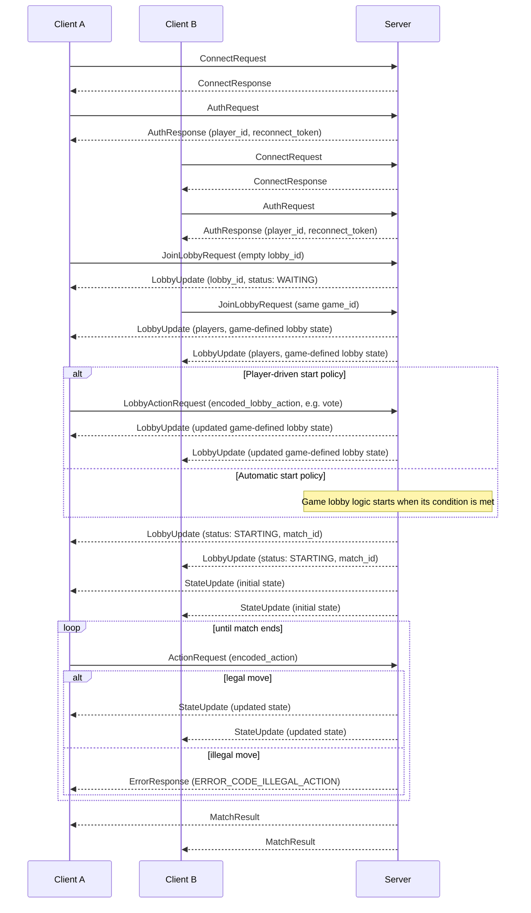

# RAMServer Wire Protocol - v1

Schema file: [`proto/ramserver/v1/ramserver.proto`](../proto/ramserver/v1/ramserver.proto) (package `ramserver.v1`, `proto3` syntax)

This document explains every message, field, and enum in the schema, and the order in which messages are exchanged. For how bytes are delimited on the TCP stream, see [Message Framing](framing.md).

## Schema overview

| Section in the proto        | Messages / enums                                                                                           |
| --------------------------- | ---------------------------------------------------------------------------------------------------------- |
| Envelopes                   | `ClientMessage`, `ServerMessage`                                                                           |
| Connection & authentication | `ConnectRequest`, `ConnectResponse`, `AuthRequest`, `AuthResponse`                                         |
| Lobby                       | `JoinLobbyRequest`, `LeaveLobbyRequest`, `LobbyActionRequest`, `LobbyUpdate`, `LobbyPlayer`, `LobbyStatus` |
| Gameplay                    | `ActionRequest`, `StateUpdate`                                                                             |
| Errors                      | `ErrorResponse`, `ErrorCode`                                                                               |
| Match completion            | `MatchResult`, `PlayerActionSummary`                                                                       |

**Generated code.** The file options control the generated packages:

- Go: `github.com/stevenlagoy/ramserver-core/server/gen/ramserver/v1`, package name `ramserver` (checked in under `server/gen/ramserver/v1/`).
- Java: package `org.ramserver.proto.v1`, one file per message (`java_multiple_files = true`), with the outer class `RamServerProto`.

**proto3 defaults.** In proto3 an unset scalar field is indistinguishable from its default (`""`, `0`, `false`, empty bytes, empty list). Throughout this document, "empty" means the field was left at its default. Each enum's `*_UNSPECIFIED = 0` value is that default; the server never sends it intentionally, and a receiver should treat it as invalid or missing.

## Envelopes and framing

Each frame payload (see [framing.md](framing.md)) is one serialized envelope: `ClientMessage` from client to server, or `ServerMessage` from server to client. A zero-length frame is a heartbeat and is not an envelope. Individual messages never appear on the wire on their own; they are always wrapped in the envelope's `payload` `oneof`, and exactly one payload field is set per envelope.

**`ClientMessage`**

| #   | Field                  | Type                 |
| --- | ---------------------- | -------------------- |
| 1   | `sequence`             | `uint64`             |
| 2   | `connect_request`      | `ConnectRequest`     |
| 3   | `auth_request`         | `AuthRequest`        |
| 4   | `join_lobby_request`   | `JoinLobbyRequest`   |
| 5   | `leave_lobby_request`  | `LeaveLobbyRequest`  |
| 6   | `action_request`       | `ActionRequest`      |
| 7   | `lobby_action_request` | `LobbyActionRequest` |

- `sequence` - a client-assigned, monotonically increasing counter used to correlate a response with the request that caused it.

**`ServerMessage`**

| #   | Field              | Type              |
| --- | ------------------ | ----------------- |
| 1   | `in_reply_to`      | `uint64`          |
| 2   | `connect_response` | `ConnectResponse` |
| 3   | `auth_response`    | `AuthResponse`    |
| 4   | `lobby_update`     | `LobbyUpdate`     |
| 5   | `state_update`     | `StateUpdate`     |
| 6   | `error_response`   | `ErrorResponse`   |
| 7   | `match_result`     | `MatchResult`     |

- `in_reply_to` - echoes the `sequence` of the client message this is a direct response to. For unsolicited server pushes, such as broadcasts to everyone in a lobby or match, this is `0`. Clients should therefore start `sequence` at `1`.

Field numbers are part of the wire format. Never renumber or reuse a field number; to remove a field, mark its number `reserved`.

## Message lifecycle

A client moves through four phases in order: **connect → authenticate → lobby → match**. Each phase's messages are valid only after the previous phase has completed.

### 1. Connect

| Message           | Direction       | Sent when                                                              |
| ----------------- | --------------- | ---------------------------------------------------------------------- |
| `ConnectRequest`  | client → server | Immediately after the TCP connection opens; must be the first message. |
| `ConnectResponse` | server → client | In reply to `ConnectRequest`.                                          |

**`ConnectRequest`**

- `protocol_version` - the schema version the client was built against. The server compares this against its own version and rejects a mismatch.
- `client_name` - free-text identifier for logging and debugging, such as `"ramserver-java-client"`.

**`ConnectResponse`** - sent only on success. On a protocol-version mismatch, the server sends `ErrorResponse` (`ERROR_CODE_INVALID_PROTOCOL_VERSION`) instead and closes the connection.

- `session_id` - server-assigned identifier for this TCP session.
- `server_protocol_version` - the server's schema version, for client-side logging.

### 2. Authenticate

| Message        | Direction       | Sent when                             |
| -------------- | --------------- | ------------------------------------- |
| `AuthRequest`  | client → server | After a successful `ConnectResponse`. |
| `AuthResponse` | server → client | In reply to `AuthRequest`.            |

**Identity vs. display name - how impersonation is prevented**

`display_name` is cosmetic only: it is shown to other players, it may collide, and it is never used to establish who someone is. Identity is handled separately.

- **New player:** send `AuthRequest` with just `display_name` (leave `player_id` and `reconnect_token` empty). The server generates a new `player_id` and a secret `reconnect_token`, returned only to that client in `AuthResponse`.
- **Resuming player** (for example, after a dropped connection): send `AuthRequest` with the previously issued `player_id` **and** `reconnect_token`. The server only grants that identity back if the token matches what it issued. A client that only knows another player's `player_id` cannot assume that identity without also knowing the secret token, which is never broadcast to anyone.
- The token is never included in any broadcast message (`LobbyUpdate`, `StateUpdate`, `MatchResult`); it is only sent directly to its owner in `AuthResponse`.
- Once authenticated, every later message on that connection is attributed to that `player_id` by the server itself. No later message, including `ActionRequest` and `LobbyActionRequest`, carries a client-supplied player identity field, so a connection can never act as a different player mid-session.

**`AuthRequest`**

- `display_name` - cosmetic label shown to other players.
- `player_id` - identity to resume, if any; empty to register new.
- `reconnect_token` - secret proving ownership of `player_id`; empty to register new.

**`AuthResponse`** - sent only on success. On failure, the server sends `ErrorResponse` (`ERROR_CODE_AUTH_FAILED`) instead, indicating either an unknown `player_id` or a `reconnect_token` that does not match.

- `player_id` - the newly issued or resumed identity.
- `reconnect_token` - secret for this identity. Store it client-side only, such as in a local config file, if you want to support resuming later.

### 3. Lobby

A lobby is a generic membership and lifecycle boundary for players preparing to play a game. The shared protocol handles joining, leaving, and publishing lobby snapshots; the registered game's lobby implementation defines everything game-specific. In particular, the game decides its admission rules, whether the lobby has an owner, which lobby actions are valid, and when the lobby transitions to a match. The protocol does not assume that the first player to join owns the lobby or that one player must manually start it.

| Message              | Direction                                               | Sent when                                                                         |
| -------------------- | ------------------------------------------------------- | --------------------------------------------------------------------------------- |
| `JoinLobbyRequest`   | client → server                                         | A player requests to join a lobby for a game.                                     |
| `LeaveLobbyRequest`  | client → server                                         | A player requests to leave a lobby.                                               |
| `LobbyActionRequest` | client → server                                         | A player submits a game-defined lobby action, such as a start vote.               |
| `LobbyUpdate`        | server → client (broadcast to all players in the lobby) | Whenever lobby membership or public lobby state changes, including match startup. |

**Lobby behavior is game-defined.** A game may start through an owner-controlled action, a vote, a timer, reaching a player threshold, or another game-specific rule. For player-driven behavior, clients send `LobbyActionRequest`, whose payload is defined by that game's lobby protocol. A timer- or condition-driven start may occur without any client action. Either way, the result is reported through `LobbyUpdate`.

**`JoinLobbyRequest`**

- `game_id` - the game to play: `"tictactoe"`, `"chess"`, or `"gofish"`. An unregistered value is rejected with `ERROR_CODE_UNKNOWN_GAME`.
- `lobby_id` - when non-empty, requests a specific lobby (`ERROR_CODE_LOBBY_NOT_FOUND` if it does not exist). When empty, asks the server to select or create a lobby according to the game's lobby policy.
- Joining a lobby that has already started or closed is rejected with `ERROR_CODE_LOBBY_ALREADY_STARTED`. Any other refusal by the game's admission rules, such as a full lobby, is reported as `ERROR_CODE_LOBBY_POLICY_REJECTED`.

**`LeaveLobbyRequest`**

- `lobby_id` - the lobby to leave. The game's lobby implementation decides whether leaving is permitted in the current lobby state.

**`LobbyActionRequest`**

- `lobby_id` - the target lobby.
- `encoded_lobby_action` - opaque bytes for an operation defined by the game's lobby protocol, such as casting or changing a start vote, or an owner requesting to start when the game allows it. The server attributes the action to the authenticated connection; the payload must not be used to assert another player's identity.

Each game's client-facing protocol must define how to encode its lobby actions and how to decode its lobby state. The server validates actions with that game's lobby implementation:

- A payload that cannot be decoded is rejected with `ERROR_CODE_MALFORMED_MESSAGE`.
- An action that is invalid, unauthorized, or not allowed in the current state is rejected with `ERROR_CODE_LOBBY_POLICY_REJECTED`.
- An action that requires a readiness condition the lobby has not met (for example, a start request before enough players have joined) may be rejected with `ERROR_CODE_LOBBY_NOT_READY`.

**`LobbyUpdate`**

- `lobby_id` - the lobby this snapshot describes. Clients learn the server-assigned id here after joining with an empty `lobby_id`.
- `game_id` - the game this lobby is for.
- `players` - the current roster, as a list of `LobbyPlayer`.
- `status` - the generic lifecycle state; see `LobbyStatus` below. It does not by itself grant any player permission to start the match.
- `match_id` - empty until the lobby transitions to `LOBBY_STATUS_STARTING`; then it holds the id to use in all subsequent `ActionRequest` messages.
- `encoded_lobby_state` - optional opaque public state defined by the game, such as an owner, vote totals, a countdown, player-count limits, readiness details, or game-specific options. Every lobby member receives it, so it must not contain secrets or per-player hidden information.

**`LobbyPlayer`**

- `player_id` - the player's server-issued identity.
- `display_name` - the player's cosmetic label from `AuthRequest`.

**`LobbyStatus`**

| Value                      | #   | Meaning                                                                                                                       |
| -------------------------- | --- | ----------------------------------------------------------------------------------------------------------------------------- |
| `LOBBY_STATUS_UNSPECIFIED` | 0   | Default; never sent intentionally.                                                                                            |
| `LOBBY_STATUS_WAITING`     | 1   | The lobby is open and has not started. It does not imply a particular player count.                                           |
| `LOBBY_STATUS_READY`       | 2   | The game reports that its readiness condition is met. Informational only; it does not authorize a particular player to start. |
| `LOBBY_STATUS_STARTING`    | 3   | The game has initiated match startup. `match_id` is set; the initial `StateUpdate` follows when the match is ready.           |
| `LOBBY_STATUS_CLOSED`      | 4   | The lobby is no longer available for joining or lobby actions.                                                                |

### 4. Match

| Message         | Direction                                               | Sent when                                                        |
| --------------- | ------------------------------------------------------- | ---------------------------------------------------------------- |
| `ActionRequest` | client → server                                         | A player submits a move.                                         |
| `StateUpdate`   | server → client (broadcast to all players in the match) | Once at match start and after every validated action.            |
| `ErrorResponse` | server → client                                         | An action is rejected, or any other protocol-level error occurs. |
| `MatchResult`   | server → client (broadcast to all players in the match) | The match reaches a win, loss, or draw condition.                |

**`ActionRequest`**

- `match_id` - from the `LobbyUpdate` that started this match.
- `encoded_action` - opaque bytes. The core does not interpret this; it hands the value directly to the match's registered `Ruleset` for validation.
- Carries no player identity field; see the impersonation note in Section 2. The acting player is always the identity bound to the sending connection.

**`StateUpdate`**

- `match_id` - the match this update belongs to.
- `state_version` - increases with every applied action. A client can use this to detect and ignore a stale or duplicate broadcast.
- `encoded_view` - opaque bytes: a per-recipient view of state. This lets a game with hidden information, such as a Go Fish hand, send each player only what they are allowed to see instead of the full authoritative state.
- `active_player_id` - whose turn it is now.
- `player_order` - the full turn order for the match. Needed for games with more than two players, where "next turn" is not just "the other player."

**`ErrorResponse`**

Usable in any phase, not just the match phase. When it answers a specific request, the envelope's `in_reply_to` identifies that request.

- `code` - see `ErrorCode` below.
- `message` - human-readable detail for logging or display only; clients should branch on `code`, not on this string.
- `match_id` - set if the error is scoped to a specific match or action; empty for connection- or lobby-level errors.

**`ErrorCode`**

| Code                                  | #   | Meaning                                                                                                             |
| ------------------------------------- | --- | ------------------------------------------------------------------------------------------------------------------- |
| `ERROR_CODE_UNSPECIFIED`              | 0   | Default; never sent intentionally.                                                                                  |
| `ERROR_CODE_INVALID_PROTOCOL_VERSION` | 1   | Client's `protocol_version` is incompatible with the server.                                                        |
| `ERROR_CODE_AUTH_FAILED`              | 2   | Unknown `player_id`, or `reconnect_token` did not match.                                                            |
| `ERROR_CODE_UNKNOWN_GAME`             | 3   | `game_id` has no registered game.                                                                                   |
| `ERROR_CODE_LOBBY_NOT_FOUND`          | 4   | `lobby_id` does not exist.                                                                                          |
| `ERROR_CODE_LOBBY_ALREADY_STARTED`    | 5   | Operation attempted on a lobby that has already started or closed.                                                  |
| `ERROR_CODE_LOBBY_NOT_READY`          | 6   | Lobby action requires a readiness condition the lobby has not met.                                                  |
| `ERROR_CODE_LOBBY_POLICY_REJECTED`    | 7   | The game's lobby policy refused a join or lobby action (invalid, unauthorized, or disallowed in the current state). |
| `ERROR_CODE_MATCH_NOT_FOUND`          | 8   | `match_id` does not exist.                                                                                          |
| `ERROR_CODE_OUT_OF_TURN`              | 9   | Action submitted by a player who is not `active_player_id`.                                                         |
| `ERROR_CODE_ILLEGAL_ACTION`           | 10  | Action rejected by the ruleset's legality check.                                                                    |
| `ERROR_CODE_MALFORMED_MESSAGE`        | 11  | An envelope, or an opaque match or lobby payload, could not be parsed.                                              |

**`MatchResult`**

- `match_id` - the match that ended.
- `winner_player_ids` - empty if `draw` is `true`; can hold more than one id if a game supports tied or shared outcomes.
- `draw` - `true` if the match ended without a winner.
- `summaries` - one `PlayerActionSummary` per player, pulled from the persisted action log. This is useful for the demo and testing requirement to show that illegal actions were rejected.

**`PlayerActionSummary`**

- `player_id` - the player this summary describes.
- `actions_accepted` - number of that player's actions the ruleset applied.
- `actions_rejected` - number of that player's actions the server rejected.

### Session flow diagram

The sequence below shows a full session for a 2-player match: connect,
authenticate, join a lobby, play until a match result. `Server` broadcasts
(`LobbyUpdate`, `StateUpdate`, `MatchResult`) to every player in the
lobby/match, not just the sender. The example leaves startup policy to the
selected game's lobby implementation: one game might use a player lobby
action (such as a vote); another might start automatically.
`JoinLobbyRequest` with an empty `lobby_id` asks the game's lobby policy to
select or create a lobby. The illegal-action branch shows the case tested by
FR-06/FR-07: a rejected match action leaves state unchanged and never reaches
`StateUpdate`.

```mermaid
sequenceDiagram
    participant A as Client A
    participant B as Client B
    participant S as Server

    A->>S: ConnectRequest
    S-->>A: ConnectResponse
    A->>S: AuthRequest
    S-->>A: AuthResponse (player_id, reconnect_token)

    B->>S: ConnectRequest
    S-->>B: ConnectResponse
    B->>S: AuthRequest
    S-->>B: AuthResponse (player_id, reconnect_token)

    A->>S: JoinLobbyRequest (empty lobby_id)
    S-->>A: LobbyUpdate (lobby_id, status: WAITING)
    B->>S: JoinLobbyRequest (same game_id)
    S-->>A: LobbyUpdate (players, game-defined lobby state)
    S-->>B: LobbyUpdate (players, game-defined lobby state)

    alt Player-driven start policy
        A->>S: LobbyActionRequest (encoded_lobby_action, e.g. vote)
        S-->>A: LobbyUpdate (updated game-defined lobby state)
        S-->>B: LobbyUpdate (updated game-defined lobby state)
    else Automatic start policy
        Note over S: Game lobby logic starts when its condition is met
    end
    S-->>A: LobbyUpdate (status: STARTING, match_id)
    S-->>B: LobbyUpdate (status: STARTING, match_id)
    S-->>A: StateUpdate (initial state)
    S-->>B: StateUpdate (initial state)

    loop until match ends
        A->>S: ActionRequest (encoded_action)
        alt legal move
            S-->>A: StateUpdate (updated state)
            S-->>B: StateUpdate (updated state)
        else illegal move
            S-->>A: ErrorResponse (ERROR_CODE_ILLEGAL_ACTION)
        end
    end

    S-->>A: MatchResult
    S-->>B: MatchResult
```

## Design notes

- **Game payloads stay opaque in the generic protocol.** `encoded_action` / `encoded_view` are interpreted by the match's game implementation; `encoded_lobby_action` / `encoded_lobby_state` are defined and interpreted by the game's lobby implementation. This keeps the networking, lobby, and persistence layers game-agnostic, and lets each game choose its own ownership model, player actions, readiness information, player limits, and start conditions without adding game-specific fields to the shared schema.
- **`game_id` is a string, not an enum.** Adding a new game already requires a server-side registration of its game and lobby behavior; keeping `game_id` as a string avoids forcing a schema change, and every client regeneration, at the same time.
- **Lobby ownership and startup are game-defined.** The shared schema has no host or owner field and no start request. A game that has an owner, or a manual start, exposes that through `encoded_lobby_state` and `encoded_lobby_action`. The shared protocol only reports lifecycle (`status`, `match_id`) and membership (`players`).
- **Identity is never self-asserted.** `player_id` is either freshly issued by the server or resumed by proving ownership via `reconnect_token`; no message after `AuthRequest` lets a client claim to be a specific player. The server always attributes actions to the identity bound to the connection. This is the core anti-impersonation guarantee and should be enforced in the session and connection layer rather than re-checked per message.
