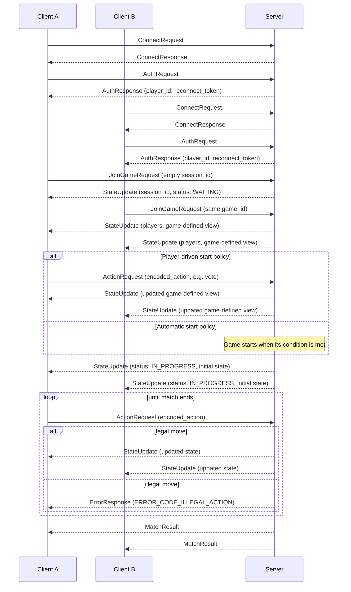

# RAMServer Wire Protocol - v1

Schema file: [`proto/ramserver/v1/ramserver.proto`](../proto/ramserver/v1/ramserver.proto) (package `ramserver.v1`, `proto3` syntax)

This document explains every message, field, and enum in the schema, and the order in which messages are exchanged. For how bytes are delimited on the TCP stream, see [Message Framing](framing.md).

## Schema overview

| Section in the proto        | Messages / enums                                                       |
| --------------------------- | ---------------------------------------------------------------------- |
| Envelopes                   | `ClientMessage`, `ServerMessage`                                       |
| Connection & authentication | `ConnectRequest`, `ConnectResponse`, `AuthRequest`, `AuthResponse`       |
| Session membership          | `JoinSessionRequest`, `LeaveSessionRequest`, `LeaveSessionResponse`     |
| Session actions & state     | `ActionRequest`, `StateUpdate`, `SessionPlayer`, `SessionStatus`       |
| Errors                      | `ErrorResponse`, `ErrorCode`                                           |
| Match completion            | `MatchResult`, `MatchEndReason`, `PlayerActionSummary`                 |

**Generated code.** Generated code is not committed; run `buf generate` after any change under `proto/` (see the [README](../README.md)). The file options control the generated packages:

- Go: `github.com/stevenlagoy/ramserver-core/server/gen/ramserver/v1`, package name `ramserver`, written to `server/gen/`.
- Java: package `org.ramserver.proto.v1`, one file per message (`java_multiple_files = true`), with the outer class `RamServerProto`.

**proto3 defaults.** In proto3 an unset scalar field is indistinguishable from its default (`""`, `0`, `false`, empty bytes, empty list). Throughout this document, "empty" means the field was left at its default. Each enum's `*_UNSPECIFIED = 0` value is that default; the server never sends it intentionally, and a receiver should treat it as invalid or missing.

## Envelopes and framing

Each frame payload (see [framing.md](framing.md)) is one serialized envelope: `ClientMessage` from client to server, or `ServerMessage` from server to client. A zero-length frame is a heartbeat and is not an envelope. Individual messages never appear on the wire on their own; they are always wrapped in the envelope's `payload` `oneof`, and exactly one payload field is set per envelope.

**`ClientMessage`**

| #   | Field                | Type               |
| --- | -------------------- | ------------------ |
| 1   | `sequence`             | `uint64`             |
| 2   | `connect_request`      | `ConnectRequest`     |
| 3   | `auth_request`         | `AuthRequest`        |
| 4   | `join_session_request` | `JoinSessionRequest` |
| 5   | `leave_session_request`| `LeaveSessionRequest`|
| 6   | `action_request`       | `ActionRequest`      |

- `sequence` - a client-assigned, monotonically increasing counter used to correlate a response with the request that caused it.

**`ServerMessage`**

| #   | Field                 | Type                |
| --- | --------------------- | ------------------- |
| 1   | `in_reply_to`           | `uint64`              |
| 2   | `connect_response`      | `ConnectResponse`     |
| 3   | `auth_response`         | `AuthResponse`        |
| 4   | `state_update`          | `StateUpdate`         |
| 5   | `error_response`        | `ErrorResponse`       |
| 6   | `match_result`          | `MatchResult`         |
| 7   | `leave_session_response` | `LeaveSessionResponse` |

- `in_reply_to` - echoes the `sequence` of the client message this is a direct response to. For unsolicited server pushes, such as broadcasts to everyone in a session, this is `0`. Clients should therefore start `sequence` at `1`.

**Every request gets exactly one direct reply.** The server answers each `ClientMessage` with exactly one `ServerMessage` whose `in_reply_to` equals that message's `sequence`. On failure the reply is an `ErrorResponse`. On success it is:

| Request            | Success reply                                                                  |
| ------------------ | ------------------------------------------------------------------------------ |
| `ConnectRequest`      | `ConnectResponse`                                                              |
| `AuthRequest`         | `AuthResponse`                                                                 |
| `JoinSessionRequest`  | The requester's copy of the `StateUpdate` broadcast that includes them         |
| `LeaveSessionRequest` | `LeaveSessionResponse`                                                         |
| `ActionRequest`       | The requester's copy of the `StateUpdate` broadcast produced by the action     |

Other players' copies of the same broadcast carry `in_reply_to = 0`. A client can therefore treat any reply with a matching `in_reply_to` as the outcome of its request.

**Unparseable envelopes.** If a frame's payload cannot be parsed as a `ClientMessage`, the server cannot read its `sequence`. It replies with `ErrorResponse` (`ERROR_CODE_MALFORMED_MESSAGE`) and `in_reply_to = 0`, and keeps the connection open.

Field numbers are part of the wire format. Never renumber or reuse a field number; to remove a field, mark its number `reserved`.

## Message lifecycle

A client moves through three phases in order: **connect → authenticate → session**. Each phase's messages are valid only after the previous phase has completed; a message sent too early, or a repeated `ConnectRequest` or `AuthRequest`, is rejected with `ERROR_CODE_INVALID_STATE`.

A **session** is one instance of a game, from the moment it is created until it closes. It covers both the waiting room before play (the lobby) and the match itself, under one `session_id` that never changes. The lobby and the match are phases of the same session, distinguished only by `SessionStatus`.

### 1. Connect

| Message           | Direction       | Sent when                                                              |
| ----------------- | --------------- | ---------------------------------------------------------------------- |
| `ConnectRequest`  | client → server | Immediately after the TCP connection opens; must be the first message. |
| `ConnectResponse` | server → client | In reply to `ConnectRequest`.                                          |

**`ConnectRequest`**

- `protocol_version` - the schema version the client was built against, as `"<major>.<minor>"` (for example, `"1.0"`). The server accepts the client when the major version equals its own, regardless of minor version. A minor bump only adds fields or enum values, which older peers ignore; a change that would break an older peer requires a major bump.
- `client_name` - free-text identifier for logging and debugging, such as `"ramserver-java-client"`.

**`ConnectResponse`** - sent only on success. On a protocol-version mismatch, the server sends `ErrorResponse` (`ERROR_CODE_INVALID_PROTOCOL_VERSION`) instead and closes the connection.

- `connection_id` - server-assigned identifier for this TCP connection, for logging and debugging. Not related to `session_id`.
- `server_protocol_version` - the server's schema version, for client-side logging.

### 2. Authenticate

| Message        | Direction       | Sent when                             |
| -------------- | --------------- | ------------------------------------- |
| `AuthRequest`  | client → server | After a successful `ConnectResponse`. |
| `AuthResponse` | server → client | In reply to `AuthRequest`.            |

**Identity vs. display name - how impersonation is prevented**

`display_name` is cosmetic only: it is shown to other players, it may collide, and it is never used to establish who someone is. Identity is handled separately.

- **New player:** send `AuthRequest` with just `display_name` (leave `player_id` and `reconnect_token` empty). The server generates a new `player_id` and a secret `reconnect_token`, returned only to that client in `AuthResponse`.
- **Resuming player** (for example, after a dropped connection): send `AuthRequest` with the previously issued `player_id` **and** `reconnect_token`. The server only grants that identity back if the token matches what it issued. A client that only knows another player's `player_id` cannot assume that identity without also knowing the secret token, which is never broadcast to anyone.
- The token is never included in any broadcast message (`StateUpdate`, `MatchResult`); it is only sent directly to its owner in `AuthResponse`.
- Once authenticated, every later message on that connection is attributed to that `player_id` by the server itself. No later message, including `ActionRequest`, carries a client-supplied player identity field, so a connection can never act as a different player mid-session.

**`AuthRequest`**

- `display_name` - cosmetic label shown to other players.
- `player_id` - identity to resume, if any; empty to register new.
- `reconnect_token` - secret proving ownership of `player_id`; empty to register new.

**`AuthResponse`** - sent only on success. On failure, the server sends `ErrorResponse` (`ERROR_CODE_AUTH_FAILED`) instead, indicating either an unknown `player_id` or a `reconnect_token` that does not match.

- `player_id` - the newly issued or resumed identity.
- `reconnect_token` - secret for this identity. Store it client-side only, such as in a local config file, if you want to support resuming later.
- `session_id` - the session the player is still a member of after a resume; empty for a new player or one not in a session.

`display_name` must be non-empty and within the server's length limit; otherwise the request is rejected with `ERROR_CODE_INVALID_ARGUMENT`.

**Resuming into a session.** When a resumed player is still a member of a session, the server sends that player the session's current `StateUpdate` (`in_reply_to = 0`) immediately after `AuthResponse`, and broadcasts the player's `connected` status to the rest of the session. If the identity was still bound to an older connection, the server closes the older connection; the newest authenticated connection always wins.

### 3. Session

| Message             | Direction                                                 | Sent when                                                                        |
| ------------------- | --------------------------------------------------------- | -------------------------------------------------------------------------------- |
| `JoinSessionRequest`   | client → server                                           | A player requests to join a session for a game.                                  |
| `LeaveSessionRequest`  | client → server                                           | A player requests to leave a session.                                            |
| `LeaveSessionResponse` | server → client                                           | In reply to a successful `LeaveSessionRequest`.                                  |
| `ActionRequest`        | client → server                                           | A player submits a game-defined action, in any phase: a start vote, a move, etc. |
| `StateUpdate`       | server → client (broadcast to all players in the session) | Whenever membership, connection status, session status, or game state changes.   |
| `ErrorResponse`     | server → client                                           | A request is rejected, or any other protocol-level error occurs.                 |
| `MatchResult`       | server → client (broadcast to all players in the session) | The match ends, normally or otherwise.                                           |

The core and the game split responsibility:

- **The core owns membership.** Joining and leaving are core messages because they bind a connection, and so a `player_id`, to a session. The core uses that binding to keep the roster, to know whom to broadcast to, and to attribute every action to the connection that sent it. A client cannot send an `ActionRequest` before joining because it has no `session_id` to send it to.
- **The game owns everything inside the session.** Every `ActionRequest` goes to the registered game implementation, whatever the session's phase. The game decides its admission rules, whether the session has an owner, which actions are valid in each phase, and when the session moves from waiting to in progress. The game may start through an owner action, a vote, a timer, reaching a player threshold, or another rule; a timer- or condition-driven start needs no client action. The protocol does not assume that the first player to join owns the session or that one player must manually start it.

**`JoinSessionRequest`**

- `game_id` - the game to play: `"tictactoe"`, `"chess"`, or `"gofish"`. An unregistered value is rejected with `ERROR_CODE_UNKNOWN_GAME`.
- `session_id` - when non-empty, requests a specific session (`ERROR_CODE_SESSION_NOT_FOUND` if it does not exist). When empty, asks the server to select or create a session according to the game's policy.
- A player can be a member of only one session at a time. A join while already a member of a session is rejected with `ERROR_CODE_ALREADY_IN_SESSION`; leave first.
- If the session cannot accept the player, for example because it has already started, has closed, or is full, the join is rejected with `ERROR_CODE_SESSION_NOT_JOINABLE`.
- On success, the server broadcasts a `StateUpdate` to the session, including the new player. The requester's copy is its reply, and it carries the server-assigned `session_id`.

**`LeaveSessionRequest`**

- `session_id` - the session to leave. Sent for a session the player is not a member of, it is rejected with `ERROR_CODE_NOT_IN_SESSION`.
- Leaving is always permitted. Leaving an in-progress match is a forfeit: the game decides whether the match continues without the player or ends with a `MatchResult` whose `reason` is `MATCH_END_REASON_FORFEIT`.
- On success, the leaver receives `LeaveSessionResponse` and no further broadcasts from the session; the remaining players receive a `StateUpdate` without the leaver.

**`LeaveSessionResponse`**

- `session_id` - the session the player left.

**Disconnects.** If a member's connection drops without a `LeaveGameRequest`, the player stays a member and the server broadcasts a `StateUpdate` with that player's `connected` set to `false`. The player has a server-configured grace period to resume (see Section 2). If they do not resume in time, they are removed as if they had left; if this ends an in-progress match, its `MatchResult` has `reason` `MATCH_END_REASON_DISCONNECT`. While a player is disconnected, the game decides whether play pauses or continues around them.

**`ActionRequest`**

- `session_id` - the session to act in.
- `encoded_action` - opaque bytes. The core does not interpret them; it passes them to the session's game implementation, which validates and applies them. The same message carries waiting-phase actions (such as casting a start vote) and in-progress actions (such as playing a card).
- `expected_state_version` - optional. When non-zero, the server rejects the action with `ERROR_CODE_STALE_STATE` unless it equals the session's current `state_version`. Set it to the `state_version` of the view the player acted on, so an action chosen against an outdated view is never applied.
- Carries no player identity field; see the impersonation note in Section 2. The acting player is always the identity bound to the sending connection.

Each game's client-facing protocol must define how to encode its actions and decode its views, for every phase. Rejected actions are reported as:

- `ERROR_CODE_NOT_IN_SESSION` - the sender is not a member of `session_id`.
- `ERROR_CODE_STALE_STATE` - `expected_state_version` did not match.
- `ERROR_CODE_MALFORMED_MESSAGE` - the payload could not be decoded.
- `ERROR_CODE_OUT_OF_TURN` - the sender is not `active_player_id`.
- `ERROR_CODE_ILLEGAL_ACTION` - any other refusal by the game, such as an illegal move, a start request before enough players have joined, or an action the sender is not permitted to take.

A rejected action leaves the session state unchanged and produces no `StateUpdate`. An accepted action always increments `state_version` and produces a `StateUpdate` broadcast, even if the visible change is small; the requester's copy is its reply. If the action ends the match, that `StateUpdate` is followed by `MatchResult`.

**`StateUpdate`**

- `session_id` - the session this snapshot describes.
- `game_id` - the game this session is for.
- `status` - the generic lifecycle state; see `SessionStatus` below. It does not by itself grant any player permission to act.
- `players` - the current roster, as a list of `SessionPlayer`.
- `state_version` - increases with every change to the session: membership, connection status, session status, or an applied action. A client can use this to detect and ignore a stale or duplicate broadcast, and passes it back as `ActionRequest.expected_state_version`.
- `encoded_view` - opaque bytes: a per-recipient view of game-defined state. While waiting, it might hold an owner, vote totals, a countdown, or player-count limits; in progress, the board or hand. Because it is per-recipient, a game with hidden information, such as a Go Fish hand, sends each player only what they are allowed to see.
- `active_player_id` - whose turn it is now; empty when no player has the turn, such as while the session is waiting.
- `player_order` - the full turn order; empty until the game sets one. Needed for games with more than two players, where "next turn" is not just "the other player."

**`SessionPlayer`**

- `player_id` - the player's server-issued identity.
- `display_name` - the player's cosmetic label from `AuthRequest`.
- `connected` - `false` while the player's connection is down and the server is waiting for them to resume; see **Disconnects** above.

**`SessionStatus`**

| Value                        | #   | Meaning                                                                                                                  |
| ---------------------------- | --- | ------------------------------------------------------------------------------------------------------------------------ |
| `SESSION_STATUS_UNSPECIFIED` | 0   | Default; never sent intentionally.                                                                                       |
| `SESSION_STATUS_WAITING`     | 1   | Players are gathering and the match has not started. It does not imply a particular player count.                       |
| `SESSION_STATUS_READY`       | 2   | The game reports that its readiness condition is met. Informational only; it does not authorize a particular player to start. |
| `SESSION_STATUS_STARTING`    | 3   | The game has initiated match startup and is setting up initial state.                                                    |
| `SESSION_STATUS_IN_PROGRESS` | 4   | The match is being played.                                                                                               |
| `SESSION_STATUS_CLOSED`      | 5   | The session has ended or been abandoned and accepts no further joins or actions.                                         |

**`ErrorResponse`**

Usable in any phase. When it answers a specific request, the envelope's `in_reply_to` identifies that request.

- `code` - see `ErrorCode` below.
- `message` - human-readable detail for logging or display only; clients should branch on `code`, not on this string.
- `session_id` - set if the error is scoped to a specific session; empty for connection-level errors.

**`ErrorCode`**

| Code                                  | #   | Meaning                                                                                                   |
| ------------------------------------- | --- | --------------------------------------------------------------------------------------------------------- |
| `ERROR_CODE_UNSPECIFIED`              | 0   | Default; never sent intentionally.                                                                        |
| `ERROR_CODE_INVALID_PROTOCOL_VERSION` | 1   | Client's `protocol_version` major version differs from the server's.                                      |
| `ERROR_CODE_AUTH_FAILED`              | 2   | Unknown `player_id`, or `reconnect_token` did not match.                                                  |
| `ERROR_CODE_UNKNOWN_GAME`             | 3   | `game_id` has no registered game.                                                                         |
| `ERROR_CODE_SESSION_NOT_FOUND`        | 4   | `session_id` does not exist.                                                                              |
| `ERROR_CODE_SESSION_NOT_JOINABLE`     | 5   | The session refused a join: already started, closed, full, or refused by the game's admission rules.      |
| `ERROR_CODE_OUT_OF_TURN`              | 6   | Action submitted by a player who is not `active_player_id`.                                               |
| `ERROR_CODE_ILLEGAL_ACTION`           | 7   | Action refused by the game in the session's current phase.                                                |
| `ERROR_CODE_MALFORMED_MESSAGE`        | 8   | An envelope, or an opaque action payload, could not be parsed.                                            |
| `ERROR_CODE_INVALID_STATE`            | 9   | Message not valid in the connection's current phase, such as `JoinGameRequest` before `AuthResponse` or a second `ConnectRequest`. |
| `ERROR_CODE_NOT_IN_SESSION`           | 10  | The session exists, but the sender is not a member of it.                                                 |
| `ERROR_CODE_ALREADY_IN_SESSION`       | 11  | `JoinGameRequest` sent by a player who is already a member of a session.                                  |
| `ERROR_CODE_INVALID_ARGUMENT`         | 12  | A field failed validation, such as an empty or overly long `display_name` or an empty `game_id`.          |
| `ERROR_CODE_STALE_STATE`              | 13  | `expected_state_version` did not match the session's current `state_version`.                            |
| `ERROR_CODE_INTERNAL`                 | 14  | The server failed while handling an otherwise valid request. Session state is unchanged.                  |

**`MatchResult`**

- `session_id` - the session whose match ended. The session moves to `SESSION_STATUS_CLOSED`.
- `winner_player_ids` - empty if `draw` is `true`; can hold more than one id if a game supports tied or shared outcomes. When a match ends by forfeit or disconnect, the game decides who, if anyone, wins.
- `draw` - `true` if the match ended without a winner.
- `summaries` - one `PlayerActionSummary` per player, pulled from the persisted action log. This is useful for the demo and testing requirement to show that illegal actions were rejected.
- `reason` - why the match ended; see `MatchEndReason` below.

**`MatchEndReason`**

| Value                          | #   | Meaning                                                                 |
| ------------------------------ | --- | ----------------------------------------------------------------------- |
| `MATCH_END_REASON_UNSPECIFIED` | 0   | Default; never sent intentionally.                                      |
| `MATCH_END_REASON_COMPLETED`   | 1   | The game reached a win, loss, or draw condition.                        |
| `MATCH_END_REASON_FORFEIT`     | 2   | A player left an in-progress match and the game ended it.               |
| `MATCH_END_REASON_DISCONNECT`  | 3   | A player's connection dropped and was not resumed within the grace period. |
| `MATCH_END_REASON_ABORTED`     | 4   | The server ended the match, such as on shutdown or an internal error.  |

**`PlayerActionSummary`**

- `player_id` - the player this summary describes.
- `actions_accepted` - number of that player's actions the game applied.
- `actions_rejected` - number of that player's actions the server rejected.

### Session flow diagram

The sequence below shows a full session for a 2-player match: connect,
authenticate, join a session, play until a match result. `Server` broadcasts
(`StateUpdate`, `MatchResult`) to every player in the session, not just the
sender. The example leaves startup policy to the selected game: one game
might use a player action (such as a vote); another might start
automatically. `JoinGameRequest` with an empty `session_id` asks the game's
policy to select or create a session. The illegal-action branch shows the
case tested by FR-06/FR-07: a rejected action leaves state unchanged and
never reaches `StateUpdate`.

```mermaid
sequenceDiagram
    participant A as Client A
    participant B as Client B
    participant S as Server

    A->>S: ConnectRequest
    S-->>A: ConnectResponse
    A->>S: AuthRequest
    S-->>A: AuthResponse (player_id, reconnect_token)

    B->>S: ConnectRequest
    S-->>B: ConnectResponse
    B->>S: AuthRequest
    S-->>B: AuthResponse (player_id, reconnect_token)

    A->>S: JoinGameRequest (empty session_id)
    S-->>A: StateUpdate (session_id, status: WAITING)
    B->>S: JoinGameRequest (same game_id)
    S-->>A: StateUpdate (players, game-defined view)
    S-->>B: StateUpdate (players, game-defined view)

    alt Player-driven start policy
        A->>S: ActionRequest (encoded_action, e.g. vote)
        S-->>A: StateUpdate (updated game-defined view)
        S-->>B: StateUpdate (updated game-defined view)
    else Automatic start policy
        Note over S: Game starts when its condition is met
    end
    S-->>A: StateUpdate (status: IN_PROGRESS, initial state)
    S-->>B: StateUpdate (status: IN_PROGRESS, initial state)

    loop until match ends
        A->>S: ActionRequest (encoded_action)
        alt legal move
            S-->>A: StateUpdate (updated state)
            S-->>B: StateUpdate (updated state)
        else illegal move
            S-->>A: ErrorResponse (ERROR_CODE_ILLEGAL_ACTION)
        end
    end

    S-->>A: MatchResult
    S-->>B: MatchResult
```

## Design notes

- **One session, one id.** The lobby and the match are phases of one session, not separate entities. A single `session_id` lasts the whole lifecycle, so clients never map a lobby id to a match id, and the server needs one "not found" error rather than two.
- **One action/update pair for every phase.** Waiting-phase actions (votes, start requests) and in-progress actions (moves) have the same shape: opaque bytes in, opaque per-recipient view out, handled by the same game implementation. Using `ActionRequest` and `StateUpdate` for both removes a duplicate message pair and a duplicate error path.
- **Membership stays in the core.** Join and leave are not game actions: they admit a connection to a session before it has a `session_id` to act in, and they maintain the roster, broadcast list, and player attribution that every game relies on. Leaving these to opaque game payloads would make each game reimplement that bookkeeping.
- **Game payloads stay opaque.** `encoded_action` and `encoded_view` are defined and interpreted only by the session's game implementation. This keeps the networking, membership, and persistence layers game-agnostic, and lets each game choose its own ownership model, readiness rules, player limits, and start conditions without game-specific fields in the shared schema.
- **`game_id` is a string, not an enum.** Adding a new game already requires a server-side registration; keeping `game_id` as a string avoids forcing a schema change, and every client regeneration, at the same time.
- **Identity is never self-asserted.** `player_id` is either freshly issued by the server or resumed by proving ownership via `reconnect_token`; no message after `AuthRequest` lets a client claim to be a specific player. The server always attributes actions to the identity bound to the connection. This is the core anti-impersonation guarantee and should be enforced in the session and connection layer rather than re-checked per message.
